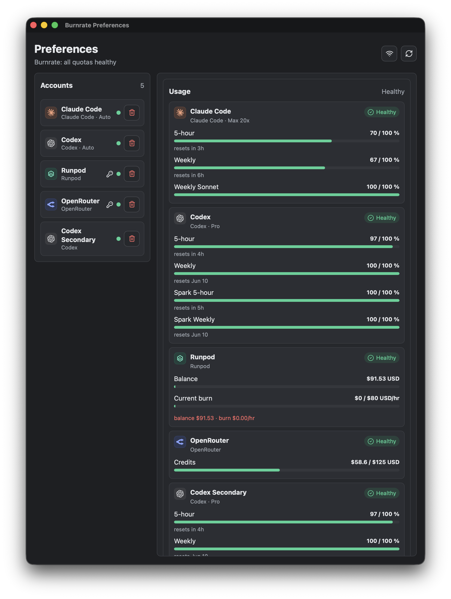
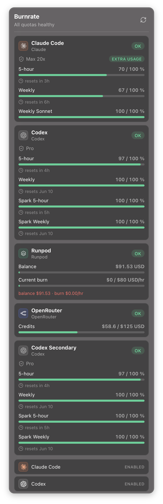

# Burnrate

[](https://github.com/jamesbrink/burnrate/actions/workflows/ci.yml)
[](https://github.com/jamesbrink/burnrate/actions/workflows/release.yml)
[](https://crates.io/crates/burnrate)
[](https://crates.io/crates/burnrate)
[](https://github.com/jamesbrink/burnrate/releases/latest)
[](LICENSE)
[](https://github.com/jamesbrink/burnrate/releases/latest)

Desktop usage monitor for Claude Code, Codex, OpenRouter, Runpod, and AWS quotas, credits, spend, and subscription limits. Built with Tauri 2 (Rust + React/TypeScript) and lives in the system tray (the menu bar on macOS).

## Screenshots

<p align="center">
  
  &nbsp;
  
</p>

<p align="center"><em>The full Preferences window (left) and the menu-bar popover (right).</em></p>

## Features

- Menu-bar tray summary with a left-click usage popover and right-click actions (Preferences, Refresh, Quit).
- Native translucent (vibrancy) popover on macOS that follows the system light/dark appearance, sizes itself to its content, and dismisses when it loses focus.
- Native Preferences window for account management and manual OpenRouter/Runpod/AWS setup.
- Auto-detects Claude Code and Codex accounts from local config; OpenRouter and Runpod are added via API key, and AWS uses your existing AWS profile/default credential chain.
- **Multiple Claude Code and Codex accounts**, each signed in from the app via browser OAuth and shown with its email address and usage.
- **Drag to reorder** accounts — reorder the tray usage cards or the Preferences list; the order persists across both windows.
- Claude Code subscription buckets (5-hour, weekly, model-specific) with stale-auth checks via `claude auth status`.
- Codex Pro/Max plan and rate-limit buckets read from the Codex app server.
- Runpod prepaid balance, current spend, burn-rate runway, active resources, and recent Pods/Serverless/storage costs.
- AWS Cost Explorer month-to-date USD spend with optional monthly budgets and configurable service/tag/cost-category buckets such as Bedrock, EC2 compute, and S3.
- Secrets in the OS keyring by default, with an explicit plaintext fallback.
- Hides from the Dock by default; appears only while Preferences is open.
- **Automatic updates (macOS)** with selectable **Stable** and **Nightly** channels: a dismissible banner and tray "Check for Updates…" entry offer a signature-verified one-click "Install & Restart." Choose the channel under Preferences → Updates.

## Install

Download the native bundle for your platform from [GitHub Releases](https://github.com/jamesbrink/burnrate/releases), or install the binary crate (it ships the prebuilt UI):

```sh
cargo install burnrate
```

## Development

```sh
npm install
npm run dev      # tauri dev — launches the desktop app + tray
```

A Nix devshell exposes the full workflow (`nix develop`, then `dev`, `check`, `test`, `fmt`, `build-app`, `build-pure`, `package-dmg`). See [AGENTS.md](AGENTS.md) for the architecture map and complete command reference.

## Providers & configuration

Claude Code usage requires a first-party `claude.ai` OAuth login with an active subscription. If Burnrate reports a stale, inference-only, or missing-subscription state, refresh with:

```sh
claude auth login
```

**Adding accounts from the app.** In Preferences, use **Add account → Sign in with browser** to authenticate a Claude Code or Codex account directly — Burnrate shells out to the official `claude` / `codex` CLI, opens your browser, and reads the resulting email and usage. Additional accounts are isolated in their own CLI config dir under `BURNRATE_CONFIG_DIR/cli/<provider>/<id>`, so the first auto-detected account keeps using your shared terminal session (`~/.claude`, `~/.codex`) while extra accounts stay separate. Signing the same email in twice refreshes the existing account instead of creating a duplicate. **Sign in again** (in an account's edit panel) re-authenticates that account in place — for the auto-detected account it refreshes your real `~/.claude` / `~/.codex` session, so it doubles as the fix for a stale or expired default login. **Sign out** (or removing the account) clears only that managed account — running the CLI sign-out and deleting its isolated dir — and never touches your system session. OpenRouter and Runpod are still added with an API key.

Burnrate refreshes in the background every five minutes and caches successful snapshots for five minutes to avoid tight polling. Runpod uses `https://rest.runpod.io/v1` for resources/billing and `https://api.runpod.io/graphql` for balance/burn state by default; `BURNRATE_RUNPOD_REST_URL` and `BURNRATE_RUNPOD_GRAPHQL_URL` can override those endpoints for development or proxies.

### AWS setup

Add AWS from **Preferences → Add account → AWS**. Burnrate uses the official AWS SDK default credential chain, so you can leave the profile blank to use `AWS_PROFILE`/`default`, or enter a shared config/credentials/SSO profile name. No static AWS access keys are stored in Burnrate. Cost Explorer is a global billing API; Burnrate defaults the SDK region to `us-east-1` when no region is configured.

The primary AWS bucket is current-month-to-date `UnblendedCost` in USD from Cost Explorer `GetCostAndUsage`. Configure an optional monthly budget amount to turn the primary spend bucket into Burnrate-style remaining/warning/exhausted status. Category buckets are user-editable Cost Explorer filters. Presets include Bedrock (`SERVICE = Amazon Bedrock`), EC2 compute (`SERVICE = Amazon Elastic Compute Cloud - Compute`), S3 (`SERVICE = Amazon Simple Storage Service`), plus custom dimension/tag/cost-category filters.

Minimum Cost Explorer permissions:

```json
{
  "Version": "2012-10-17",
  "Statement": [
    {
      "Effect": "Allow",
      "Action": ["ce:GetCostAndUsage", "sts:GetCallerIdentity"],
      "Resource": "*"
    }
  ]
}
```

Cost Explorer data is not real time. Current-month data can be delayed and AWS may mark fresh results as estimated; Burnrate surfaces estimated results and pagination in the account message. `UsageQuantity` is intentionally not used for the primary bucket because units are not meaningful across mixed AWS services.

Optional future AWS features may require additional permissions only when enabled: service discovery/autocomplete (`ce:GetDimensionValues`), Budgets (`budgets:DescribeBudget`, `budgets:DescribeBudgets`), Free Tier (`freetier:GetFreeTierUsage`), and Bedrock operational CloudWatch metrics (`cloudwatch:GetMetricData`, `cloudwatch:ListMetrics`).

Only non-secret account configuration is stored on disk. On macOS the default path is `~/Library/Application Support/burnrate/burnrate.sqlite`; set `BURNRATE_CONFIG_DIR` to override. Legacy `accounts.json` files are imported once, then renamed to `accounts.json.migrated-<timestamp>`. Manual secrets live in the OS keyring unless plaintext storage is explicitly selected for that account.

## Troubleshooting (macOS)

- **Keychain re-prompts on every launch.** macOS binds a keychain "Always Allow" grant to the requesting app's _code signature_. An unsigned binary (a bare `cargo build` / `cargo install` build, or an unsigned `.app`) presents a different identity each build, so the grant never sticks. Install a **code-signed** build and the grant persists: build one with `APPLE_SIGNING_IDENTITY="Developer ID Application: …" package-dmg` (run `security find-identity -v -p codesigning` to list identities). As an alternative, switch the account to **plaintext** secret storage in Preferences to skip the keychain entirely.
- **Provider CLI "failed to start" in a `.app` install.** Apps launched from Finder/Launchpad inherit a minimal `PATH`. Burnrate searches the common install locations for `codex`/`claude`; if yours lives elsewhere, point at it with `BURNRATE_CODEX_BIN` / `BURNRATE_CLAUDE_BIN`.

## Releases

- `release-plz` manages crate release PRs, version tags, and crates.io publishing.
- Tagging `v*` builds native Tauri bundles (macOS, Linux, Windows) and uploads them with checksums to the GitHub Release, then publishes a signed `latest.json` (the **Stable** auto-update manifest).
- A `nightly` workflow runs after green `CI` on `main`, building a signed macOS pre-release and promoting it to the rolling `nightly` release/manifest (the **Nightly** channel).
- Auto-update signing uses a Tauri minisign keypair: the public key lives in `tauri.conf.json`; the private key + passphrase are the `TAURI_SIGNING_PRIVATE_KEY` / `TAURI_SIGNING_PRIVATE_KEY_PASSWORD` repo secrets.

## License

[MIT](LICENSE)
